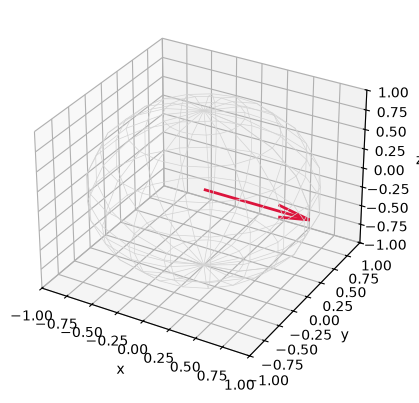
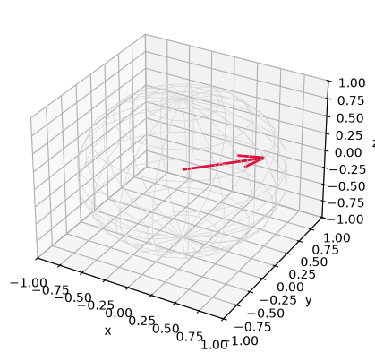
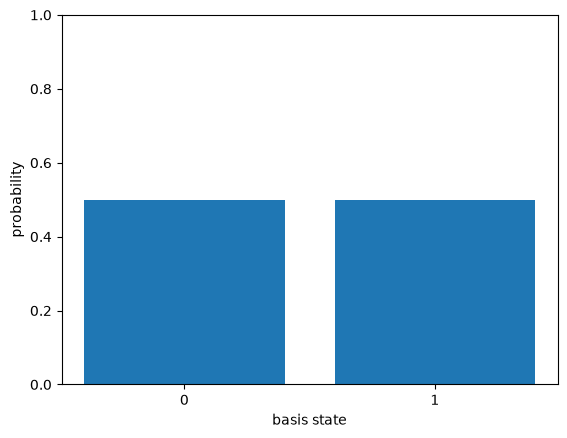

# What is a qubit?

*Quantum computing from scratch, post 0.*

I wanted to understand quantum computing properly, which for me means building
the thing rather than driving a framework that does the linear algebra in the
basement and hands back an answer. So this series builds a simulator from
nothing, in Python, on top of NumPy, and writes down what falls out along the
way. The code lives in a small package called `qfs`. Each post adds one piece.

The encouraging part, and the reason a from-scratch approach is even sane here:
a single qubit is a tiny object. It is a unit vector in a two dimensional
complex space. That is the entire definition. Everything that gets described as
spooky (superposition, the Bloch sphere, measurement collapse) is something you
can watch happen inside a length-two array. Nothing is hidden. By the end of
this post we will have looked at all three directly.


```python
import numpy as np

from qfs import gates
from qfs.statevector import StateVector
from qfs import viz
```

## The state is a vector

A qubit state is a vector in $\mathbb{C}^2$:

$$|\psi\rangle = \alpha\,|0\rangle + \beta\,|1\rangle, \qquad |\alpha|^2 + |\beta|^2 = 1.$$

The two basis vectors $|0\rangle = (1, 0)$ and $|1\rangle = (0, 1)$ are the
classical bit values. The numbers $\alpha$ and $\beta$ are *amplitudes*. They
are complex, and they are not probabilities. The probabilities come later, when
we measure, and they are the squared magnitudes of the amplitudes. The
normalization constraint $|\alpha|^2 + |\beta|^2 = 1$ is just the statement that
those probabilities have to sum to one.

In `qfs` a state is a `StateVector`. A fresh one starts in the ground state
$|0\rangle$.


```python
psi = StateVector(1)
psi.amps
```


    array([1.+0.j, 0.+0.j])


That array is the state. `amps[0]` is the amplitude of $|0\rangle$, `amps[1]`
the amplitude of $|1\rangle$. The probabilities are the squared magnitudes:


```python
psi.probabilities()
```


    array([1., 0.])


## Gates are unitary matrices

A quantum gate on one qubit is a $2 \times 2$ matrix. It has to be *unitary*,
meaning $U^\dagger U = I$, for one concrete reason: the state is required to
stay a unit vector (the probabilities must keep summing to one), and unitary
matrices are exactly the ones that preserve length. So the constraint is not a
rule imposed from outside. It is the only kind of matrix that keeps a valid
state valid.

Three gates are enough to get started. `X` is the bit flip (the quantum NOT).
`Z` leaves $|0\rangle$ alone and flips the sign of $|1\rangle$. `H`, the
Hadamard, is the one that builds a superposition.


```python
# X flips |0> to |1>
StateVector(1).apply(gates.X, 0).amps
```


    array([0.+0.j, 1.+0.j])


```python
# H takes |0> to an equal superposition, usually written |+>
StateVector(1).apply(gates.H, 0).amps
```


    array([0.70710678+0.j, 0.70710678+0.j])


## Superposition is just a vector that is not on an axis

That last state, $\frac{1}{\sqrt{2}}(|0\rangle + |1\rangle)$, is "superposition."
It is worth saying plainly what it is and is not. It is a unit vector that does
not point along either basis axis. Nothing is in two places. The qubit is not
secretly 0 and 1 at the same time in any classical sense. There are just two
amplitudes, both nonzero, and they are bookkeeping for what happens when this
state interferes with itself or gets measured.

Apply `H` twice and the two halves interfere back into the state you started
with. That cancellation is the whole game later, when algorithms arrange for the
wrong answers to cancel and the right ones to add.


```python
StateVector(1).apply(gates.H, 0).apply(gates.H, 0).amps
```


    array([1.+0.j, 0.+0.j])


## The Bloch sphere: the geometry of one qubit

A single qubit has more structure than a list of two complex numbers lets you
see at a glance. Two complex numbers are four real numbers, the normalization
removes one, and an overall phase that has no observable effect removes another.
What is left is two real degrees of freedom, which is the surface of a sphere.
Every pure single-qubit state is a point on it. This is the Bloch sphere.

The three coordinates of that point are the expectation values of the Pauli
observables, $\langle X \rangle$, $\langle Y \rangle$, and $\langle Z \rangle$.
$|0\rangle$ sits at the north pole, $|1\rangle$ at the south, and the
superpositions live around the equator.


```python
viz.bloch_vector(StateVector(1))                    # |0> -> north pole
```


    array([0., 0., 1.])


```python
viz.bloch_vector(StateVector(1).apply(gates.X, 0))  # |1> -> south pole
```


    array([ 0.,  0., -1.])


```python
viz.bloch_vector(StateVector(1).apply(gates.H, 0))  # |+> -> on the equator
```


    array([1., 0., 0.])


```python
# bind to _ so the figure renders once (the inline backend), not twice
_ = viz.plot_bloch(StateVector(1).apply(gates.H, 0))
```


    

    


Once you have the sphere, the rotation gates stop being abstract. `Ry(theta)`
rotates the state by an angle `theta` around the y axis. Dial `theta` and the
point slides from the north pole down toward the equator and on to the south.
Here is a state a third of the way around.


```python
psi = StateVector(1).apply(gates.Ry(np.pi / 3), 0)
print("bloch vector:", viz.bloch_vector(psi))
print("amplitudes:  ", psi.amps)
_ = viz.plot_bloch(psi)
```

    bloch vector: [0.8660254 0.        0.5      ]
    amplitudes:   [0.8660254+0.j 0.5      +0.j]


    

    


## Measurement: the one irreversible step

Everything so far is reversible. Gates are unitary, so you can always undo them.
Measurement is the exception, and it is where the probabilities finally show up.

The Born rule: the probability of outcome $b$ is $|\alpha_b|^2$. Measuring does
two things. It samples an outcome according to those probabilities, and then it
*collapses* the state to be consistent with what it saw. After you measure a
qubit and get 0, the state is exactly $|0\rangle$. The other amplitude is gone.

Start with $|+\rangle$, where the two outcomes are equally likely.


```python
psi = StateVector(1).apply(gates.H, 0)
psi.probabilities()
```


    array([0.5, 0.5])


Sampling many shots of a freshly prepared $|+\rangle$ gives roughly half zeros
and half ones. (`sample` does not collapse the stored state, it just draws
outcomes from the current probabilities, which is what a real run of many
identical preparations would give you.)


```python
shots = StateVector(1, rng=np.random.default_rng(0)).apply(gates.H, 0).sample(1000)
shots
```


    {'1': 527, '0': 473}


```python
_ = viz.plot_probabilities(StateVector(1).apply(gates.H, 0))
```


    

    


A single `measure` is the irreversible one. It returns a bit and leaves the
state collapsed onto the matching basis state. Run the next cell a few times
with different seeds and you will see the outcome flip between 0 and 1, but the
post-measurement state is always a definite basis state, never the superposition
you started from.


```python
psi = StateVector(1, rng=np.random.default_rng(2)).apply(gates.H, 0)
outcome = psi.measure(0)
print("measured:", outcome)
print("state after measurement:", psi.amps)
```

    measured: 1
    state after measurement: [0.+0.j 1.+0.j]


## Where this leaves us

That is a qubit, in full. A unit vector in $\mathbb{C}^2$. Gates are unitary
rotations of that vector, and the Bloch sphere makes the rotations literal.
Measurement is sampling by the Born rule followed by collapse. No piece of that
needed a framework or a quantum computer, just a length-two complex array and
the constraint that it stay normalized.

One qubit is not where the interesting things are, though. The moment you have
two qubits, you can write down states that do not factor into a separate state
for each qubit. There is no answer to "what is qubit 0 doing" on its own. That
failure to factor is entanglement, and it is the next post, where we generalize
the `StateVector` to many qubits and build the first Bell state.
