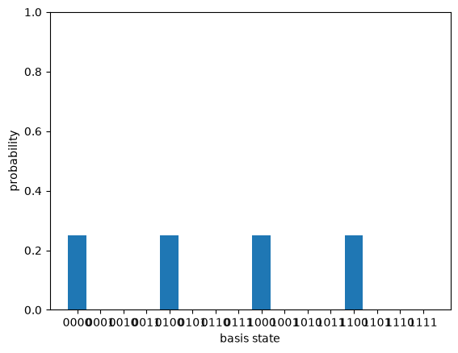

# The Quantum Fourier Transform

*Quantum computing from scratch, post 4.*

The last three posts built circuits whose payoff was a single global fact read
out by interference. This post builds the tool that most of the famous quantum
algorithms use to do that readout: the Quantum Fourier Transform. It is exactly
the discrete Fourier transform you may know from signal processing, applied to
the amplitudes of a state instead of the samples of a signal. The reason it
matters is one sentence: the QFT turns periodicity in a state into peaks at the
corresponding frequency, and phase estimation and Shor's algorithm are both ways
of cashing that in.


```python
import numpy as np

from qfs import gates
from qfs.statevector import StateVector
from qfs.algorithms.qft import qft_matrix, qft_circuit
from qfs import viz
```

## A change of basis

The QFT on $n$ qubits ($N = 2^n$ amplitudes) is the unitary

$$F_{jk} = \frac{1}{\sqrt{N}}\, \omega^{jk}, \qquad \omega = e^{2\pi i / N}.$$

It is a change of basis, from the computational basis (positions) to the Fourier
basis (frequencies). `qfs` builds it directly from that formula, and it is
unitary, as any change of basis must be.


```python
F = qft_matrix(3)
np.allclose(F @ F.conj().T, np.eye(8))
```


    True


The first thing to look at is the QFT of $|0\rangle$, a state perfectly localized
at one position. Its transform is perfectly spread out: every frequency equally.


```python
qft_matrix(3) @ StateVector(3).amps   # QFT of |000>: uniform, 1/sqrt(8) everywhere
```


    array([0.35355339+0.j, 0.35355339+0.j, 0.35355339+0.j, 0.35355339+0.j,
           0.35355339+0.j, 0.35355339+0.j, 0.35355339+0.j, 0.35355339+0.j])


That is Fourier duality, the same fact that says a sharp spike in time is a flat
spectrum and vice versa. Localized in one basis means spread out in the other. It
is worth holding onto, because it is the reason the QFT cannot just hand you an
amplitude: the information you want is usually smeared across the whole register
until you arrange for it to interfere into a peak.

## Periodicity becomes peaks

Here is the property the algorithms are built on. Take a state that is periodic
in position, a comb with a tooth every $r$ slots, and transform it. The result is
a comb in frequency with a tooth every $N/r$ slots. The period $r$ becomes the
spacing $N/r$. Read the spacing, recover the period.


```python
N, n, r = 16, 4, 4
comb = np.zeros(N, dtype=complex)
comb[0::r] = 1                       # teeth at positions 0, 4, 8, 12 (period r = 4)
comb /= np.linalg.norm(comb)
position = StateVector.from_amplitudes(comb)
frequency = StateVector.from_amplitudes(qft_matrix(n) @ comb)

print("position teeth:  ", [i for i, p in enumerate(position.probabilities()) if p > 1e-9])
print("frequency peaks: ", [i for i, p in enumerate(frequency.probabilities()) if p > 1e-9])
```

    position teeth:   [0, 4, 8, 12]
    frequency peaks:  [0, 4, 8, 12]


```python
_ = viz.plot_probabilities(position)
```


    

    


```python
_ = viz.plot_probabilities(frequency)
```


    

    


Four teeth in position, spaced by 4, become four peaks in frequency, spaced by
$N/r = 16/4 = 4$. Squeeze the comb tighter (smaller $r$) and the frequency peaks
spread further apart: a period-2 position comb gives just two peaks, at 0 and
$N/2 = 8$. This reciprocity is the whole mechanism. Shor's algorithm prepares a
state whose period $r$ is the secret it wants (the order of a number modulo $N$),
runs the QFT, measures, and reads a multiple of $N/r$ off the frequency register.
The next post, phase estimation, is the same move in its purest form.

## The same transform, as a circuit

The matrix is the definition. The circuit is how you actually run it on qubits,
and it is surprisingly cheap. Each qubit gets a Hadamard, then a ladder of
controlled phase rotations from the qubits below it, and the whole register is
reversed at the end. `qfs` builds that with `qft_circuit`, and it is the same
unitary as the matrix, exactly.


```python
rng = np.random.default_rng(0)
psi = rng.normal(size=8) + 1j * rng.normal(size=8)
psi /= np.linalg.norm(psi)

via_matrix = qft_matrix(3) @ psi
via_circuit = qft_circuit(3).run(state=StateVector.from_amplitudes(psi)).amps
print("gate circuit equals the matrix:", np.allclose(via_matrix, via_circuit))
```

    gate circuit equals the matrix: True


Two details earn a comment. The controlled phase rotations get exponentially
smaller as the qubits get further apart (angle $2\pi / 2^{k-j+1}$ between qubits
$j$ and $k$), which is why a real device eventually stops bothering with the
tiniest ones. And the reversal at the end is not decoration: the natural circuit
produces the output qubits in reversed bit order, so a layer of swaps puts them
back. Getting that reversal wrong is the single most common bug in a
from-scratch QFT, which is why `qfs` checks the circuit against the matrix and
against Qiskit for every size up to four qubits.

## The classical connection, and the catch

This really is the transform from classical signal processing. Up to a global
normalization it is the inverse FFT.


```python
v = rng.normal(size=8) + 1j * rng.normal(size=8)
np.allclose(qft_matrix(3) @ v, np.sqrt(8) * np.fft.ifft(v))
```


    True


So why is the quantum version interesting, if it computes the same thing? Two
reasons, pulling in opposite directions. The circuit uses about $n^2$ gates to
transform $N = 2^n$ amplitudes, where the classical FFT needs $N \log N$
operations: exponentially fewer steps. But you cannot read the $N$ output
amplitudes back out. You get one measurement, one sample from the frequency
distribution. The art of a quantum algorithm is arranging for that single sample
to be the one number you needed, which is exactly what the peak-from-periodicity
trick does.

## Where this leaves us

The QFT is the readout half of the quantum-algorithm toolkit: a cheap change of
basis that converts a period hidden in a state into a frequency you can sample.
We have it as a matrix (the definition), as a circuit (the implementation), and
checked the two agree exactly.

The next post puts it to work. Phase estimation takes a unitary and one of its
eigenstates, and uses the QFT to read the eigenvalue's phase off a counting
register. It is the direct route to Shor's algorithm, and the first place the QFT
stops being a curiosity and starts being a measurement instrument.
