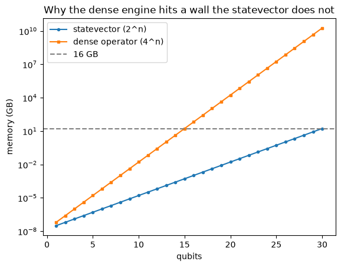

# Scaling the simulator

*Quantum computing from scratch, post 7.*

This post does not add a quantum idea. It fixes an engineering mistake we have
been making since post 1, on purpose, because it was the clearest thing to build
first. Every gate so far has been applied by constructing a dense matrix of size
2^n by 2^n and multiplying the statevector by it. That matrix has 4^n entries. At
a dozen qubits it stops fitting in memory, which is why Shor's algorithm last post
was stuck at N = 15. The fix is to never build the matrix at all.


```python
import time

import numpy as np
import matplotlib.pyplot as plt

from qfs import gates
from qfs.dense import embed
from qfs.tensor import apply_gate
from qfs.statevector import StateVector
```

## A statevector is a tensor

The amplitudes are a flat array of length 2^n, but they are indexed by `n` bits,
one per qubit. So the natural shape is not a vector, it is an `n`-dimensional grid
with two entries along each axis: a rank-`n` tensor, with axis `q` belonging to
qubit `q`. Reshaping is free, just a reinterpretation of the same buffer.


```python
n = 3
amps = StateVector(n).apply(gates.H, 0).apply(gates.X, 2, controls=(0,)).amps
print("flat shape: ", amps.shape)
print("tensor shape:", amps.reshape([2] * n).shape)
```

    flat shape:  (8,)
    tensor shape: (2, 2, 2)


A `k`-qubit gate is also a tensor: a 2^k by 2^k matrix is really `2k` axes, `k`
for its inputs and `k` for its outputs. Applying the gate is a *contraction*: glue
the gate's input axes to the state's target axes, sum over them, and leave every
other qubit's axis untouched. That is one `np.tensordot` call, and it costs
O(2^n) instead of O(4^n) because it never visits the qubits the gate does not act
on. The whole engine is six lines.


```python
import inspect
print(inspect.getsource(apply_gate))
```

    def apply_gate(amps, U, targets, n):
        """Apply k-qubit gate U to `targets` of an n-qubit statevector by contraction.
    
        U is 2^k x 2^k (k = len(targets)). The order of `targets` is part of the
        contract: gate wire i (the i-th pair of row/column indices of U, big-endian)
        acts on qubit targets[i], so targets=[c, t] and targets=[t, c] with the same U
        are different operations. Returns the new length-2^n amplitude vector. Cost is
        O(2^n), versus O(4^n) to build the dense operator.
        """
        k = len(targets)
        psi = amps.reshape([2] * n)
        Ut = U.reshape([2] * (2 * k))
        psi = np.tensordot(Ut, psi, axes=(list(range(k, 2 * k)), list(targets)))
        psi = np.moveaxis(psi, list(range(k)), list(targets))
        return psi.reshape(2 ** n)
    


## It agrees with the dense engine, exactly

This is the same operation we have been doing, computed a cheaper way, so it had
better give the same answer. It does, to floating-point precision, for single-qubit
gates and for controlled gates alike.


```python
rng = np.random.default_rng(0)
v = rng.normal(size=2 ** 4) + 1j * rng.normal(size=2 ** 4)
v /= np.linalg.norm(v)

same_1q = np.allclose(apply_gate(v, gates.H, [2], 4), embed(gates.H, 2, 4) @ v)
cnot = embed(gates.X, 1, 2, controls=(0,))                  # 4x4 CNOT as a 2-qubit gate
same_cnot = np.allclose(apply_gate(v, cnot, [3, 1], 4), embed(gates.X, 1, 4, controls=(3,)) @ v)
print("tensor == dense, single-qubit gate:", same_1q)
print("tensor == dense, CNOT:             ", same_cnot)
```

    tensor == dense, single-qubit gate: True
    tensor == dense, CNOT:              True


## The payoff: it does not hit the wall

Here is the point of the whole exercise. Apply a Hadamard to every one of twenty
qubits. The dense path would need a 2^20 by 2^20 matrix, about seventeen thousand
gigabytes. The tensor path does it in milliseconds.


```python
n = 20
v = np.zeros(2 ** n, dtype=complex)
v[0] = 1.0
t0 = time.time()
for q in range(n):
    v = apply_gate(v, gates.H, [q], n)
elapsed = time.time() - t0
# the loop takes a few hundred milliseconds; we assert that rather than printing the
# measured time, so the rendered post stays reproducible, while the size contrast
# below (a few MB of statevector versus terabytes of operator) carries the point
assert elapsed < 5.0
print(f"H on all {n} qubits: done, a {2 ** n * 16 / 1e6:.0f} MB statevector")
print(f"the dense operator would be {(2 ** n) ** 2 * 16 / 1e12:.1f} TB, which is why we never build it")
print("result is the uniform superposition:", np.allclose(np.abs(v), 1 / np.sqrt(2 ** n)))
```

    H on all 20 qubits: done, a 17 MB statevector
    the dense operator would be 17.6 TB, which is why we never build it
    result is the uniform superposition: True


The reason is simple to picture. The statevector grows as 2^n. The dense operator
grows as 4^n, its square. On a log scale they are two straight lines with different
slopes, and the gap between them is the difference between roughly thirteen qubits
and roughly thirty on the same machine.


```python
ns = np.arange(1, 31)
statevector_gb = (2.0 ** ns) * 16 / 1e9
dense_gb = (2.0 ** ns) ** 2 * 16 / 1e9
fig, ax = plt.subplots()
ax.semilogy(ns, statevector_gb, marker="o", markersize=3, label="statevector (2^n)")
ax.semilogy(ns, dense_gb, marker="s", markersize=3, label="dense operator (4^n)")
ax.axhline(16, color="gray", linestyle="--", label="16 GB")
ax.set_xlabel("qubits")
ax.set_ylabel("memory (GB)")
ax.set_title("Why the dense engine hits a wall the statevector does not")
ax.legend()
plt.show()
```


    

    


## A bonus: any gate, not just controlled ones

The dense `apply` could only do a single-qubit gate with some control qubits. The
tensor engine takes the full `2^k by 2^k` matrix of any `k`-qubit gate and applies
it directly, so gates that were awkward before are now trivial. A SWAP exchanges
two qubits:


```python
swap = np.array([[1, 0, 0, 0], [0, 0, 1, 0], [0, 1, 0, 0], [0, 0, 0, 1]], dtype=complex)
psi = np.zeros(8, dtype=complex)
psi[0b100] = 1                                              # |100>
out = apply_gate(psi, swap, [0, 2], 3)                     # swap qubit 0 and qubit 2
print("SWAP |100> on qubits 0,2 ->", format(int(np.argmax(np.abs(out))), "03b"))
```

    SWAP |100> on qubits 0,2 -> 001


And a Toffoli (a NOT on the target only when both controls are 1), the three-qubit
gate at the heart of reversible classical logic, is just its 8 by 8 matrix handed to
the same function:


```python
toffoli = embed(gates.X, 2, 3, controls=(0, 1))            # 8x8 Toffoli
psi = np.zeros(8, dtype=complex)
psi[0b110] = 1                                             # |110>: both controls set
print("Toffoli |110> ->", format(int(np.argmax(np.abs(apply_gate(psi, toffoli, [0, 1, 2], 3)))), "03b"))
```

    Toffoli |110> -> 111


## Honest limits

This is the standard exact statevector simulator, and it is what real tools use up
to the point where exactness becomes impossible. The ceiling is now memory for the
*state*, not the operator: 2^n complex numbers is about 16 GB at 30 qubits and a
terabyte at 36, so a laptop tops out near 30. Past that you give something up. The
research frontier uses tensor-network methods that stay cheap as long as the
entanglement stays low, and approximate methods when it does not. We will not go
there. Thirty qubits is plenty of room for the rest of this book.

## Where this leaves us

We swapped the engine under the hood without changing a single result, and bought
ourselves roughly seventeen extra qubits. That is the whole post: the same physics,
computed the way it scales.

Everything up to here, including this faster engine, still represents a state as one
vector with definite amplitudes. That picture has a hard edge, and we are about to
walk off it. A real qubit is never alone; it is entangled with a world we do not
track, and there is no single vector that describes it. The next post introduces the
object that can: the density matrix.
