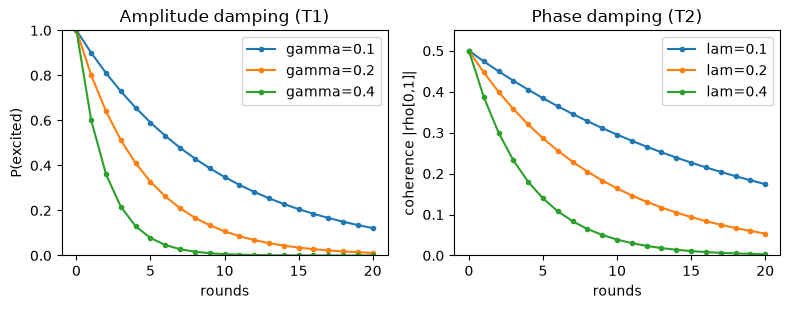

# Noise and decoherence

*Quantum computing from scratch, post 9.*

Last post ended with a warning: the off-diagonal coherences of a density matrix
are the fragile part, and a real qubit loses them on its own. This post makes that
concrete. A real qubit is never isolated. It is weakly, continuously entangling
itself with its environment, the stray fields and vibrations and photons around it,
and the environment is precisely the thing we have no choice but to trace away.
Post 8 showed that tracing away an entangled partner turns a pure state mixed. Do
it continuously and the qubit decays. We package that decay as a *channel*: a set
of Kraus operators that evolve the density matrix as
$\rho \mapsto \sum_k K_k\, \rho\, K_k^\dagger$, the non-unitary cousin of a gate.


```python
import numpy as np
import matplotlib.pyplot as plt

from qfs import gates
from qfs.density import DensityMatrix
from qfs.channels import amplitude_damping, phase_damping, depolarizing, bit_flip, apply_channel
```

## Two ways to decay

Hardware people measure two times, called T1 and T2, and they correspond to two
channels. **Amplitude damping** is energy loss: an excited $|1\rangle$ relaxes to
$|0\rangle$ with some probability. Start a qubit in $|1\rangle$ and its excited
population bleeds away.


```python
dm = DensityMatrix.from_statevector([0, 1])     # |1>
for _ in range(3):
    apply_channel(dm, amplitude_damping(0.3), 0)
print("P(excited) after 3 rounds of amplitude damping:", round(dm.probabilities()[1], 3))
```

    P(excited) after 3 rounds of amplitude damping: 0.343


**Phase damping** is subtler and, for quantum computing, deadlier. It takes no
energy, the populations on the diagonal never move, but it shrinks the off-diagonal
coherence. The qubit keeps its probabilities and loses its quantum-ness. Put a qubit
in $|+\rangle$, where the coherence is maximal, and watch only the off-diagonal
fall.


```python
dm = DensityMatrix(1).apply(gates.H, 0)         # |+>: coherence 0.5
print("before: populations", dm.probabilities(), " coherence", round(abs(dm.rho[0, 1]), 3))
apply_channel(dm, phase_damping(0.5), 0)
print("after:  populations", dm.probabilities(), " coherence", round(abs(dm.rho[0, 1]), 3))
```

    before: populations [0.5 0.5]  coherence 0.5
    after:  populations [0.5 0.5]  coherence 0.354


## Watching coherence die

Both processes are exponential. Here they are side by side: amplitude damping
draining the excited population (T1), and phase damping draining the coherence (T2),
each for a few noise strengths. This is the picture of why a quantum computer has a
clock it is racing against.


```python
steps = np.arange(0, 21)
fig, (ax1, ax2) = plt.subplots(1, 2, figsize=(8, 3.2))

for gamma in (0.1, 0.2, 0.4):
    pops = []
    dm = DensityMatrix.from_statevector([0, 1])
    for _ in steps:
        pops.append(dm.probabilities()[1])
        apply_channel(dm, amplitude_damping(gamma), 0)
    ax1.plot(steps, pops, marker="o", markersize=3, label=f"gamma={gamma}")
ax1.set_title("Amplitude damping (T1)")
ax1.set_xlabel("rounds"); ax1.set_ylabel("P(excited)"); ax1.set_ylim(0, 1); ax1.legend()

for lam in (0.1, 0.2, 0.4):
    cohs = []
    dm = DensityMatrix(1).apply(gates.H, 0)
    for _ in steps:
        cohs.append(abs(dm.rho[0, 1]))
        apply_channel(dm, phase_damping(lam), 0)
    ax2.plot(steps, cohs, marker="o", markersize=3, label=f"lam={lam}")
ax2.set_title("Phase damping (T2)")
ax2.set_xlabel("rounds"); ax2.set_ylabel("coherence |rho[0,1]|"); ax2.set_ylim(0, 0.55); ax2.legend()

plt.tight_layout()
plt.show()
```


    

    


## Decoherence on an entangled state

The same thing happens to entanglement, which is the resource the algorithms run
on. Take a Bell state, whose coherence lives in the corner entries $\rho_{0,3}$ and
$\rho_{3,0}$, and dephase one of its two qubits. The shared coherence decays even
though we only touched one side, and the once-pure entangled pair drifts toward a
boring classical mixture of $|00\rangle$ and $|11\rangle$.


```python
dm = DensityMatrix.from_statevector([1 / np.sqrt(2), 0, 0, 1 / np.sqrt(2)])
print("Bell coherence rho[0,3]:", round(abs(dm.rho[0, 3]), 3))
for _ in range(20):
    apply_channel(dm, phase_damping(0.3), 0)
print("after 20 rounds on one qubit:", round(abs(dm.rho[0, 3]), 4))
print("populations untouched:", np.allclose(np.diag(dm.rho).real, [0.5, 0, 0, 0.5]))
print("purity dropped from 1 toward 1/2:", round(np.trace(dm.rho @ dm.rho).real, 3))
```

    Bell coherence rho[0,3]: 0.5
    after 20 rounds on one qubit: 0.0141
    populations untouched: True
    purity dropped from 1 toward 1/2: 0.5


## The whole zoo

Two more channels round out the standard set. **Depolarizing** is the pessimist's
model: with some probability the qubit is simply replaced by noise, dragging any
state toward the maximally mixed $\tfrac{1}{2}I$. **Bit flip** and **phase flip**
apply an $X$ or a $Z$ with probability $p$; they are the discrete errors a code can
catch, and they are exactly what the next post defends against.


```python
dm = DensityMatrix.from_statevector([1, 0])
apply_channel(dm, depolarizing(0.75), 0)
print("depolarizing(0.75) on |0> drifts toward I/2:\n", np.round(dm.rho, 3))
```

    depolarizing(0.75) on |0> drifts toward I/2:
     [[0.625+0.j 0.   +0.j]
     [0.   +0.j 0.375+0.j]]


## Where this leaves us

Noise is not a bug in the model, it is the honest consequence of the density matrix
meeting the real world. Energy leaks (amplitude damping), phase scrambles (phase
damping), and either way the coherences that make a qubit more than a classical bit
fade toward zero. That is the central engineering problem of quantum computing, and
the reason a circuit has to finish before its qubits forget what they were doing.

We are not, however, helpless. The discrete errors at the end, the stray $X$ and
$Z$ flips, can be detected and undone without ever measuring the protected data, by
spreading one logical qubit across several physical ones. That is quantum error
correction, the last post and the reason a noisy machine can still, in principle,
compute forever.
