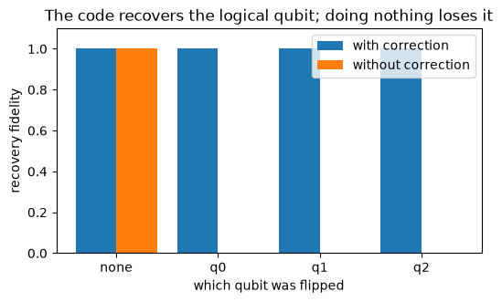

# Quantum error correction

*Quantum computing from scratch, post 10. The last one.*

Last post was the bad news: a real qubit leaks its coherence into the environment
and forgets what it was doing. This post is the reason quantum computing is not
therefore hopeless. You can detect errors and undo them, even on a state you are
forbidden to look at, by spreading one logical qubit across several physical ones.
The idea is old (classical codes repeat bits and take a majority vote) but the
quantum version has to get past two walls that do not exist classically: you cannot
copy an unknown qubit, and looking at a qubit destroys its superposition. The
3-qubit code threads both needles, and building it is a fitting last thing to build.


```python
import numpy as np
import matplotlib.pyplot as plt

from qfs import gates
from qfs.dense import embed
from qfs.qec import (
    encode_bitflip, bitflip_syndrome, correct_bitflip, decode_bitflip,
    run_bitflip_code, run_phaseflip_code,
)
```

## Encoding without cloning

A logical qubit $a|0\rangle + b|1\rangle$ is encoded as $a|000\rangle + b|111\rangle$.
This looks like copying, but it is not: there is no operation that copies an unknown
qubit, and we are not doing one. We start with the logical qubit on wire 0 and use two
CNOTs to entangle wires 1 and 2 with it. The three physical qubits now hold one logical
qubit as an inseparable whole, and crucially $a$ and $b$ are never duplicated or read.


```python
a, b = 0.6, 0.8
encoded = encode_bitflip(a, b)
print("encoded amplitudes (only |000> and |111> nonzero):")
print("  |000>:", round(encoded[0b000].real, 3), "   |111>:", round(encoded[0b111].real, 3))
```

    encoded amplitudes (only |000> and |111> nonzero):
      |000>: 0.6    |111>: 0.8


## The syndrome: finding the error without reading the data

Now flip one qubit, say qubit 1. The state becomes $a|010\rangle + b|101\rangle$. We
need to learn *which* qubit flipped without learning *anything* about $a$ and $b$,
because measuring $a$ or $b$ would collapse the superposition we are trying to
protect. The trick is to measure two *parities*: $Z_0 Z_1$ asks "do qubits 0 and 1
agree?" and $Z_1 Z_2$ asks the same of 1 and 2. A parity is the same for the
$|0\ldots\rangle$ branch and the $|1\ldots\rangle$ branch, so it reveals the error
location and nothing about the logical state. The pair of answers is the *syndrome*.


```python
for error_qubit in (None, 0, 1, 2):
    psi = encode_bitflip(a, b)
    if error_qubit is not None:
        psi = embed(gates.X, error_qubit, 3) @ psi
    print(f"error on qubit {str(error_qubit):4s} -> syndrome {bitflip_syndrome(psi)}")
```

    error on qubit None -> syndrome (1, 1)
    error on qubit 0    -> syndrome (-1, 1)
    error on qubit 1    -> syndrome (-1, -1)
    error on qubit 2    -> syndrome (1, -1)


Each error gives a distinct syndrome, so the syndrome tells us exactly which qubit
to flip back. Apply the correction, reverse the encoding, and the logical qubit comes
out untouched. Here is the whole loop, and here is the proof that it works: the
recovered state has fidelity 1 with the original for *any* single-qubit error, while
doing nothing (no correction) destroys it completely.


```python
def fidelity(a, b, error_qubit, correct):
    psi = encode_bitflip(a, b)
    if error_qubit is not None:
        psi = embed(gates.X, error_qubit, 3) @ psi
    if correct:
        psi = correct_bitflip(psi)
    psi = decode_bitflip(psi)
    return abs(np.conj(a) * psi[0] + np.conj(b) * psi[0b100])


labels = ["none", "q0", "q1", "q2"]
errors = [None, 0, 1, 2]
with_corr = [fidelity(a, b, e, True) for e in errors]
without = [fidelity(a, b, e, False) for e in errors]

x = np.arange(len(labels))
fig, ax = plt.subplots(figsize=(6, 3.2))
ax.bar(x - 0.2, with_corr, 0.4, label="with correction")
ax.bar(x + 0.2, without, 0.4, label="without correction")
ax.set_xticks(x); ax.set_xticklabels(labels)
ax.set_ylabel("recovery fidelity"); ax.set_ylim(0, 1.1)
ax.set_xlabel("which qubit was flipped")
ax.set_title("The code recovers the logical qubit; doing nothing loses it")
ax.legend()
plt.show()
```


    

    


## Phase errors, and the other code

This code only catches bit flips. A phase error, a $Z$ that sends $|1\rangle$ to
$-|1\rangle$, commutes with the $Z$ parities and slips through invisibly. But there
is a beautiful fix: a phase error in the computational basis is a bit flip in the
Hadamard basis, because $HZH = X$. So sandwich the same machinery between layers of
Hadamards and you get a code that corrects $Z$ errors instead. The phase-flip code
recovers the logical state under any single $Z$ error.


```python
a, b = 0.6, 0.8
for error_qubit in (0, 1, 2):
    ra, rb = run_phaseflip_code(a, b, error_qubit=error_qubit)
    print(f"phase error on qubit {error_qubit} -> recovered ({round(ra.real,3)}, {round(rb.real,3)})  (input was {a}, {b})")
```

    phase error on qubit 0 -> recovered (0.6, 0.8)  (input was 0.6, 0.8)
    phase error on qubit 1 -> recovered (0.6, 0.8)  (input was 0.6, 0.8)
    phase error on qubit 2 -> recovered (0.6, 0.8)  (input was 0.6, 0.8)


The full Shor 9-qubit code stacks these two ideas, three blocks of the phase-flip
code each protected by the bit-flip code, to correct an arbitrary single-qubit
error (any combination of $X$ and $Z$, including $Y$). It is the same construction
twice, and we will leave it as the natural next exercise.

## The honest limit, and the way past it

This is a distance-3 code: it corrects one error and fails on two. Two flips produce
a syndrome that points at the innocent third qubit, the correction makes things
worse, and the logical qubit flips. There is no magic here, just a code too small to
tell one story from another.


```python
psi = encode_bitflip(1, 0)                              # logical |0>
psi = embed(gates.X, 0, 3) @ embed(gates.X, 1, 3) @ psi  # two flips
out = decode_bitflip(correct_bitflip(psi))
print("two errors: logical |0> was miscorrected into |1>:", np.allclose([out[0], out[0b100]], [0, 1]))
```

    two errors: logical |0> was miscorrected into |1>: True


Real machines use bigger codes, the surface code chief among them, that correct more
errors by using many more physical qubits per logical one. The deep result that makes
the whole enterprise possible is the *threshold theorem*: if the physical error rate
is below a fixed threshold, you can drive the logical error rate as low as you like by
scaling the code up, faster than the errors accumulate. Below the threshold, a noisy
machine can compute reliably forever. That is the promise the entire field is built on.

## The end of the book

We started, ten posts ago, with the claim that a qubit is just a unit vector in
$\mathbb{C}^2$ and that everything mysterious about quantum computing is something you
can watch happen inside an array. We have now cashed that claim in full. Superposition
and interference were complex numbers adding and cancelling. Entanglement was a vector
that would not factor. Measurement was sampling and renormalizing. The famous
algorithms (Deutsch-Jozsa, Grover, the Fourier transform, phase estimation, Shor's
factoring) were each a few lines of NumPy that we checked against Qiskit. Then mixed
states, noise, decoherence, and finally error correction showed us the real machine,
the one that leaks and the one engineers fight to protect.

The whole simulator is about three hundred lines of Python and a hundred and fifty
tests. None of it needed a quantum computer, or a framework, or anything beyond a
length-two complex array and the patience to follow the linear algebra wherever it
went. That was always the point. The spooky parts are not spooky once you build them.
They are just what the math does.
